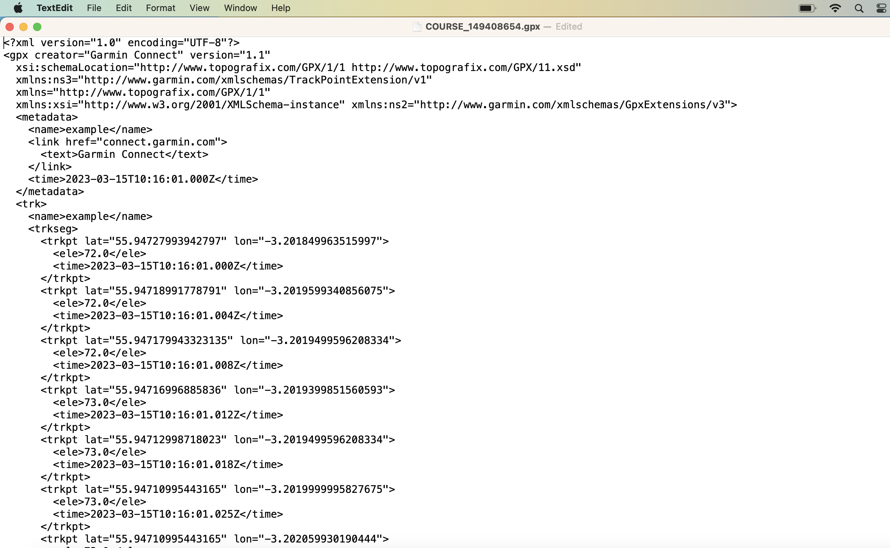

```{r setup, include=FALSE}
knitr::opts_chunk$set(echo = TRUE, fig.align = 'center')
```

<br>

# Learning Objectives

* Be able to extract data from `.gpx` files
* Be able to extract data from `.fit` files
* Be able to overlay route details from `.gpx` and `.fit` files on maps using `leaflet()`

<br>

# Introduction

Smart watches, fitness trackers and various other devices are becoming more and more popular for people who want to keep track of their leisure activities such as running, cycling, swimming etc.  In most cases these devices have some global positioning functionality that allows users to retain a record of where they've been, or where they want to go.
<br>


<br>
<br>
A lot of these spatial details are stored by default as either `.gpx` or `.fit` files.  So what are they?  
<br>
`.gpx` files usually contain little more that spatial elements and are normally created in advance of an activity, providing a route map for a user to follow.  `.fit` files usually also contain similar spatial data, but also include additional parameters such as speed, distance, heart rate, step count, calories, respiration rate etc., and are more commonly used to analyse the performance aspects of a user's activity.
<br>

From a more technical point of view;

## `.gpx` Files

A `.gpx` or GPS eXchange Format file is a common open format XML (extensible markup language) file containing geospatial data relating to "waypoints", "tracks" and "routes".

If you open up a `.gpx` file in a text editor then you'll see something like this;

<br>

```{r, echo=FALSE, out.width = '80%'}

```

<br>

This looks complicated, but in fact is just a sequence of latitudes and longitudes (often with elevation, time, and other data fields) that collectively make a route that a GPS enabled device can follow.  This sequence of positions can be overlaid onto a map to provide additional context.

As a minimum, `.gpx` files will always contain latitude and longitude. All other elements are optional.

<br>

## `.fit` Files

`.fit` (Flexible and Interoperable Data Transfer) files were developed by Garmin Ltd. specifically for storing data resulting from sporting activities.  A `.fit` file can contain almost 100 different variables and the exact file contents can vary depending on the device that created it.  `.fit` files often contain data not only relating to GPS position (latitude/longitude/elevation) but also other data often recorded from additional sensors such as heart rate monitors, power monitors, step counters etc.  

An added complication of this is that each of these different physical data sources (heart rate monitor, step counter, GPS unit etc.) all send their data to the same `.fit` file, with each sensor having it's own specific list of measurement values within the file.  But each of them can be activated at slightly different times, resulting in one `.fit` file containing multiple lists of data with slightly different start and/or stop times!  So, a potentially rich source, but one which might need some careful handling.

Let's start by looking at `.gpx` files;

<br>

# Handling `.gpx` Files in R with `plotKML()`

We're going to use the `plotKML()` package to interpret a `.gpx` file in R.

```{r, warning = FALSE, message = FALSE}
library(tidyverse)
library(plotKML)
library(leaflet)
library(here)
```


To start, let's read in the data using `the readGPS()` function from `plotKML`.

```{r}
gpx <- readGPX(here("data/COURSE_149408654.gpx"))
```


The `.gpx` file structure is set up as a series of lists, namely;

* metadata
* bounds
* waypoints
* tracks
* routes

In this example we only have track data, so let's extract that, save it as a tibble and see what it looks like.

```{r}
track <- as_tibble(gpx$tracks[[1]][[1]])

head(track)
```


So our data contains latitude and longitude, elevation and time observations.  The time column corresponds with the time the `.gpx` track was created (maybe using a mapping website) and doesn't reflect the time an activity was carried out.  

Note that our elevation column is stored as a character and should be changed into a numeric if we want to use it in any analysis;

```{r}
track_gpx <- track %>% 
  mutate(ele = as.numeric(ele))
```

We should now be able to overlay this onto a map using the `addPolyLines()` function in `leaflet()`.    At this stage we don't know what our maximum and minimum latitude and longitude should be, but we can use `min()` and `max()` to determine this when we make the plot.

```{r}
track_gpx %>% 
leaflet() %>%
  fitBounds(lng1 = min(track_gpx$lon), lat1 = min(track_gpx$lat),
            lng2 = max(track_gpx$lon), lat2 = max(track_gpx$lat)) %>%
  addTiles() %>%  
  addPolylines(lng = ~lon,
               lat = ~lat)

```


<br>


## Optional Extra: Overlaying Elevation Data from `.gpx` as a Colour Gradient

<details>

Our `.gpx` file also contains information about our route elevation and it would be nice to have an indication of elevation on our track as a colour gradient.

`leaflet()` maps are generated using javascript under the hood, so adding additional layers of information to our plotted track is not necessarily straightforward within the confines of R.  However, there are packages available to help us.  We're going to use a javascript plug-in called `leaflet.hotline`, but don't worry - you don't need to be able to understand javascript to use it!  You can find more information about the plug-in [here](https://github.com/iosphere/Leaflet.hotline).

For our plugin to work successfully we'll also need the following libraries;
```{r}
library(htmltools)
library(htmlwidgets)
```

We're going to use the same `track` data that we imported earlier.

The first thing we need to do is to download the javascript plug-in to our project environment.
```{r}
# Download the plug-in to your current project folder.

download.file(
  # This is where we're getting the plug-in from
  "https://raw.githubusercontent.com/iosphere/Leaflet.hotline/master/dist/leaflet.hotline.js",  
  # this is where we're saving the plug-in details (relative to our project top level)
  "leaflet.hotline.js", 
  # and we're using a binary version
  mode="wb") 
```

Now that we've downloaded the plug-in, we need to load it into our environment and register it;
```{r}
#load the plugin
hotlinePlugin <- htmltools::htmlDependency(
  name = 'Leaflet.hotline',
  version = "0.4.0",
  # file path in the next line should be the directory containing this .Rmd file
    src = c(file = normalizePath(here())), 
  script = "leaflet.hotline.js"
  )
#register plugin
registerPlugin <- function( map, plugin ) {
  map$dependencies <- c( map$dependencies, list( plugin ) )
  map
}
```


And now it's ready to use in our `leaflet()` plot.  

```{r}
leaflet() %>% 
  addTiles() %>% 
  fitBounds(
    lng1 = min(track_gpx$lon), lat1 = min(track_gpx$lat),
    lng2 = max(track_gpx$lon), lat2 = max(track_gpx$lat)) %>% 
  registerPlugin(hotlinePlugin) %>%
  onRender("function(el, x, data) {
    data = HTMLWidgets.dataframeToD3(data);
    data = data.map(function(val) { return [val.lat, val.lon, val.ele]; });
    L.hotline(data, {renderer: L.Hotline.renderer(), min: 0, max: 100}).addTo(this); }", 
    data = track_gpx)


```

You can see from the code chunk above that in addition to our previous code we've added `registerPlugin()` for the javascript plug-in that we want to use and then added a small block of javascript that we want to run when the map is rendered using `onRender()`.

If all you want is a colour-graded elevation overlay on your map then this is fine and you don't need to know any more javascript.  Suffice to say that the values in `{min: __, max: __}` relate to the minimum and maximum elevation values that you want to include in the colour grading layer.  High elevations will be red, low elevations will be green.

</details>

# Handling `.fit` Files in R with `FITfileR()`

Although `.fit` files are an open format data type, there are often some intricacies specific to different device manufacturers that mean that not all `.fit` files can be processed in *exactly* the same way.  A brief overview of some of these differences can be found [here](https://logiqx.github.io/gps-wizard/fit.html).

For the purposes of this example we're going to look at data collected on a Garmin device (the `.fit` file format was developed by Garmin, so if anyone's doing things properly it should be them!).

`FITfileR` is currently only available from github and can be downloaded as follows:
```{r, eval=FALSE}
if (!require(remotes)) install.packages("remotes")
remotes::install_github("grimbough/FITfileR")
```

**Note:** `FITfileR()` needs the most up to date version of `rlang()` to install successfully

Once installed, call the library:
```{r}
library(tidyverse)
library(FITfileR) # note: needs current version of 'rlang' to install successfully
```

The first thing to do is to read our data using `readFitFile()` from `FITfileR()`.  

**Note:** Be aware that `readFitFile()` needs *forward slash* directory separators - be careful if you copy file path names straight from windows (which use backslash)!

```{r}
activity <- readFitFile(here("data/718883059.fit"))
```

If we try to view our activity data directly then we only get a fraction of the total information:

```{r}
activity
```

The `.fit` file specification allows for almost 100 different types of data "message".  To view all of the message types stored within a specific file that are available for analysis you can use the function `listMessageTypes()`.

```{r}
listMessageTypes(activity)
```


Usually when we work with `.fit` files we are going to be interested in certain types of data, typically location, speed, elevation, etc. This type of data is classed as "records" and can be accessed using the `records()` function.

```{r}
activity_records <- records(activity)

activity_records
```

You will often see that `activity_records` contains a list of several tibbles.  This happens when the file contains multiple distinct definitions of the activity record. This happens when multiple data recording devices send data simultaneously to the `.fit` file (e.g. GPS + heart rate monitor + step counter) and each start acquiring data at different times.

If you look at each tibble individually you will see that all of the column headers are the same, which means that you can often merge all of the messages together into a single tibble using `bind_rows()` and then arrange the resulting data by timestamp to make sure that it is in chronological order.  Any missing values will be filled with NA. 

```{r}
all_activity_records <- records(activity) %>% 
  bind_rows() %>% 
  arrange(timestamp) 

all_activity_records
```


This looks very much like the dataset we got from our `.gpx` file  to plot in leaflet, and we can use this data in the same way.  For a simple track plot we can use the track data from `all_activity_records` as follows;

```{r}
# note that the .fit file refers to 'altitude' rather than 'elevation'
track_fit <- all_activity_records %>%
  rename(ele = altitude,
         lat = position_lat,
         lon = position_long) %>% 
  drop_na() # drop na for plotting to render successfully

```


And then plot our activity using `leaflet()`.

```{r}
track_fit %>% 
  leaflet() %>% 
  fitBounds(lng1 = min(track_fit$lon), lat1 = min(track_fit$lat),
            lng2 = max(track_fit$lon), lat2 = max(track_fit$lat)) %>% 
  addTiles() %>% 
  addPolylines(lng = ~lon,
               lat = ~lat)


  
```

<br>


## Optional Extra: Overlaying Additional Data Layers from `.fit`

<details>

<br>
We can use the inherent versatility of `leaflet()` to add more information to this, such as start and stop points, elevation data using `leaflet.hotline` and additional markers as required, e.g. we already have `leaflet.hotline` installed and registered from when we added layers to our `.gpx` file plot, so there's no need to redo that for this example.  So let's add the following;

* Start point marker
* End point marker
* Marker to show where the user's maximum speed was achieved

<br>

```{r}
# Determine start and end points;
start_lat <- first(track_fit$lat)
start_lon <- first(track_fit$lon)

end_lat <- last(track_fit$lat)
end_lon <- last(track_fit$lon)

# Determine the point at which max speed was reached
speed_peak <- track_fit %>% 
  filter(speed == max(speed))

speed_label <- paste("Maximum Speed: ", speed_peak$speed)

# And plot:
leaflet() %>% 
  addProviderTiles(providers$Esri.WorldImagery) %>% 
  fitBounds(lng1 = min(track_fit$lon), lat1 = min(track_fit$lat),
            lng2 = max(track_fit$lon), lat2 = max(track_fit$lat)) %>% 
  addMarkers(lng = speed_peak$lon, 
                   lat = speed_peak$lat,
                   label = speed_label) %>% 
  addCircleMarkers(lng = start_lon,
                   lat = start_lat,
                   label = "Start",
                   radius = 4,
                   col = "slateblue",
                   opacity = 1) %>% 
  addCircleMarkers(lng = end_lon,
                   lat = end_lat,
                   label = "End",
                   radius = 4,
                   col = "red",
                   opacity = 1) %>%
  registerPlugin(hotlinePlugin) %>%
  onRender(data = track_fit, "function(el, x, data) {
    data = HTMLWidgets.dataframeToD3(data);
    data = data.map(function(val) { return [val.lat, val.lon, val.ele]; });
    L.hotline(data, {renderer: L.Hotline.renderer(), min: 100, max: 400}).addTo(this); }")


```

</details>

<br>


But remember; data can't always tell you **everything**...

<br>

```{r, echo=FALSE, out.width = '50%'}

```

